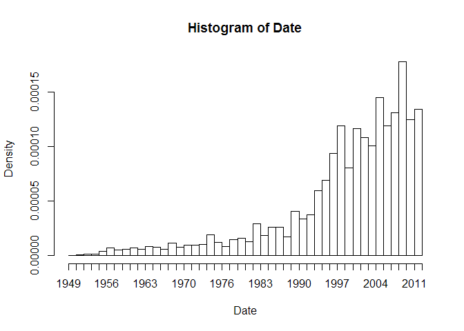
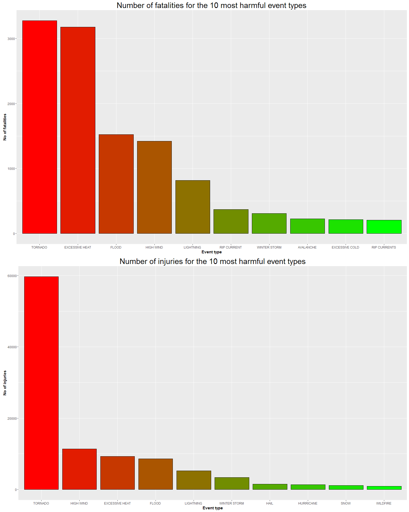
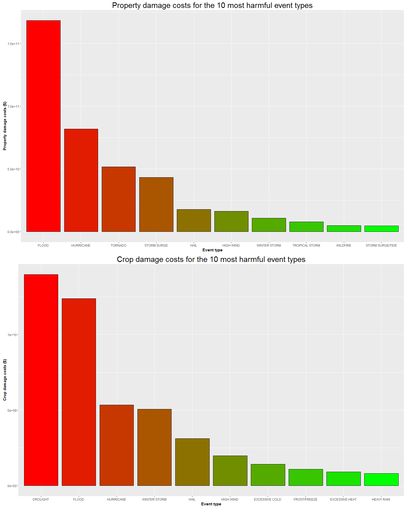

# Assessment of economic and population health effects of the most harmful environmental event types in United States between January 1970 and November 2011
Przemyslaw Zientala  
November 17, 2015  

#Synopsis
The aim of this report is to quantitatively assess how much of an effect the most harmful environmental event types had in economic and population health terms. This analysis is based on [U.S. National Oceanic and Atmospheric Administration's (NOAA) storm dataset](https://d396qusza40orc.cloudfront.net/repdata%2Fdata%2FStormData.csv.bz2). For the puropse of the analysis, data will be appropriately tidied. The assessment is based on appropriately transformed data. The results are presented separetely for population health and economic data and indicate that for both categories, tornadoes are responsible for the most damages and injuries/fatalities.


#Data Processing

##Preprocessing

Load necessary libraries:

```r
suppressMessages(library(easyGgplot2))
suppressMessages(library(data.table))
suppressMessages(library(dplyr))
suppressMessages(library(ggplot2))
suppressMessages(library(grDevices))
suppressMessages(library(R.utils))
```

First, check whether the file exists and if not, download and unzip it:

```r
if(!file.exists("repdata-data-StormData.csv.bz2")){
      download.file("https://d396qusza40orc.cloudfront.net/repdata%2Fdata%2FStormData.csv.bz2", "repdata-data-StormData.csv.bz2")
      bunzip2("repdata-data-StormData.csv.bz2")
      
}else if(!file.exists("repdata-data-StormData.csv")){
      bunzip2("repdata-data-StormData.csv.bz2")
}
```

Load the file:

```r
storm <- suppressMessages(fread("repdata-data-StormData.csv"))
```

```
## Warning in fread("repdata-data-StormData.csv"): Read less rows (902297)
## than were allocated (967216). Run again with verbose=TRUE and please
## report.
```

Check the dimensions of data to ensure correct loading:

```r
dim(storm)
```

```
## [1] 902297     37
```
As we can see, the dimensions are indeed as expected.

Now, we convert the "BGN_DATE" column to "date" format in order to subset data from more recent, complete years (we aren't concerned about the column with end time for just subsetting to narrow down more recent years):

```r
storm$BGN_DATE <- as.Date(storm$BGN_DATE, "%m/%d/%Y %H:%M:%S")
```

To check where the data should be "cut off", let's produce a quick, exploratory frequency histogram of "BGN_DATE":

```r
hist(storm[,BGN_DATE], breaks = 75, xlab = "Date")
```

 

**Figure 1.** *Histogram showing the distribution of dates.*


We can see that there is a sharp rise in records for years after 1990. However, for the sake of more complete results, I decided to choose an earlier year, 1970:

```r
storm <- storm[BGN_DATE >= "1970-01-01",]
```

Check the dimensions to find out how much data we won't be using:

```r
dim(storm)
```

```
## [1] 866041     37
```

Now we have around 40000 less rows in the dataset, which, compared to the total of over 900000 means we haven't omitted a significant amount of data (just over 4%).

It needs to be borne in mind that there might be events which didn't cause any economic damage but resulted in injuries/fatalities and *vice versa*.

Thus, I will create separate datasets needed to address each of the 2 questions.

##Population health data analysis

First, I will analyse data to find out which types of events (as indicated in the EVTYPE variable) are most harmful with respect to population health. Also, the rows where both FATALITIES and INJURIES are equal to 0 are omitted, due to these rows not contributing to the final result at all:

```r
storm_health <- storm[,.(EVTYPE, FATALITIES, INJURIES)]
storm_health <- storm_health[!(FATALITIES == 0 & INJURIES == 0),]
```

Event types need to be reasonably cleaned:

```r
cold <- grep("[Cc][Oo]{2}[Ll]|[Cc][Oo][Ll][Dd]", storm_health$EVTYPE)
snow <- grep("[Ss][Nn][Oo][Ww]", storm_health$EVTYPE)
wind <- grep("[Ww][Ii][Nn][Dd]", storm_health$EVTYPE)
rain <- grep("[Rr][Aa][Ii][Nn]|[Ss][Hh][Oo][Ww][Ee][Rr]", storm_health$EVTYPE)
heat <- grep("[Hh][Ee][Aa][Tt]|[Ww][Aa][Rr][Mm]|[Hh][Oo][Tt]", storm_health$EVTYPE)
hurricane <- grep("[Hh][Uu][Rr][Ii][Cc][Aa][Nn][Ee]", storm_health$EVTYPE)
hurricane <- grep("[Tt][Yy][Pp][Hh][Oo]{2}[Nn]", storm_health$EVTYPE)
tornado <- grep("[Tt][Oo][Rr][Nn][Aa][Dd][Oo]", storm_health$EVTYPE)
flood <- grep("[Ff][Ll][Oo]{2}[Dd]", storm_health$EVTYPE)
current <- grep("[Cc][Uu][Rr][Ee][Nn][Tt]", storm_health$EVTYPE)
wint_storm <- grep("(ICE|WINTER) STORM", storm_health$EVTYPE)
hail <- grep("[Hh][Aa][Ii][Ll]", storm_health$EVTYPE)
storm_health$EVTYPE[cold] <- "EXCESSIVE COLD"
storm_health$EVTYPE[snow] <- "SNOW"
storm_health$EVTYPE[wind] <- "HIGH WIND"
storm_health$EVTYPE[rain] <- "HEAVY RAIN"
storm_health$EVTYPE[heat] <- "EXCESSIVE HEAT"
storm_health$EVTYPE[hurricane] <- "HURRICANE"
storm_health$EVTYPE[tornado] <- "TORNADO"
storm_health$EVTYPE[flood] <- "FLOOD"
storm_health$EVTYPE[current] <- "RIP CURRENT"
storm_health$EVTYPE[wint_storm] <- "WINTER STORM"
storm_health$EVTYPE[hail] <- "HAIL"
#Here, I update the levels of "EVTYPE" factor so that it matches the new one with fewer levels
storm_health$EVTYPE <- factor(storm_health$EVTYPE, levels = as.character(unique(storm_health$EVTYPE)))
storm_health_filter <- storm_health
```

With these transformations I managed to go down to

```r
length(unique(storm_health$EVTYPE))
```

```
## [1] 95
```
event types.


A quick analysis shows that the distributions of fatalities and injuries are extremely right-skewed:

```r
summary(storm_health$FATALITIES)
```

```
##     Min.  1st Qu.   Median     Mean  3rd Qu.     Max. 
##   0.0000   0.0000   0.0000   0.6527   1.0000 583.0000
```

```r
summary(storm_health$INJURIES)
```

```
##     Min.  1st Qu.   Median     Mean  3rd Qu.     Max. 
##    0.000    1.000    1.000    5.555    3.000 1700.000
```

It is obvious that there are outliers in the data. However, I won't be excluding them, as this could lead to an underestimation of injuries/fatalities. It is an inherent feature of certain types of events (ex. hurricanes, droughts, heatwaves etc.) that they have very spatially extensive effects.

So now, let's explore the data and see which event types are responsible for the most fatalities and injuries:

```r
storm_summary <- storm_health %>% group_by(EVTYPE) %>% summarise(sum(FATALITIES), sum(INJURIES))
colnames(storm_summary) <- c("event_type", "fatalities", "injuries")
storm_summary$event_type <- factor(storm_summary$event_type)
storm_summary <- arrange(storm_summary, desc(fatalities))
```

Prepare the data for fatalities first - reorder factor levels according to descending order of fatalities:

```r
storm_summary <- arrange(storm_summary, desc(fatalities))
storm_summary$event_type <- factor(storm_summary$event_type, levels = as.character(storm_summary$event_type))
```

The code for the fatalities graph:

```r
fatal <- ggplot(storm_summary[1:10], aes(event_type, fatalities))
cols <- colorRampPalette(c("red", "green"))
fatal_bar <- fatal + geom_bar(stat = "identity", fill = cols(10), color = "black") + xlab("Event type") + ylab("No of fatalities") + ggtitle ("Number of fatalities for the 10 most harmful event types") +
      theme(axis.title.x = element_text(face="bold"), axis.title.y = element_text(face="bold"), plot.title = element_text(size=22))
```

Prepare the data for injuries - reorder factor levels according to descending order of injuries:

```r
storm_summary <- arrange(storm_summary, desc(injuries))
storm_summary$event_type <- factor(storm_summary$event_type, levels = as.character(storm_summary$event_type))
```

The code for the injuries graph:

```r
injury <- ggplot(storm_summary[1:10], aes(event_type, injuries))
cols <- colorRampPalette(c("red", "green"))
injury_bar <- injury + geom_bar(stat = "identity", fill = cols(10), color = "black") + xlab("Event type") + ylab("No of injuries") + ggtitle ("Number of injuries for the 10 most harmful event types") +
      theme(axis.title.x = element_text(face="bold"), axis.title.y = element_text(face="bold"), plot.title = element_text(size=22))
```


##Economic data analysis

I will now address the question of which types of events have the greatest economic consequences.

First, subset the data so that we only have the columns we are concerned with:

```r
storm_econ <- storm[,.(EVTYPE, PROPDMG, PROPDMGEXP, CROPDMG, CROPDMGEXP)]
```

Now, let's check classes of each column's data:

```r
str(storm_econ)
```

```
## Classes 'data.table' and 'data.frame':	866041 obs. of  5 variables:
##  $ EVTYPE    : chr  "TSTM WIND" "TSTM WIND" "TORNADO" "TSTM WIND" ...
##  $ PROPDMG   : num  0 0 25 0 0 0 25 0 0 250 ...
##  $ PROPDMGEXP: chr  "" "" "K" "" ...
##  $ CROPDMG   : num  0 0 0 0 0 0 0 0 0 0 ...
##  $ CROPDMGEXP: chr  "" "" "" "" ...
##  - attr(*, ".internal.selfref")=<externalptr>
```


Subset by the rows where both PROPDMG and CROPDMG are not equal to 0:

```r
storm_econ <- storm_econ[!(PROPDMG == 0 & CROPDMG == 0)]
```

I apply the same regex substitution as previously in case of "storm_health":

```r
cold <- grep("[Cc][Oo]{2}[Ll]|[Cc][Oo][Ll][Dd]", storm_econ$EVTYPE)
snow <- grep("[Ss][Nn][Oo][Ww]", storm_econ$EVTYPE)
wind <- grep("[Ww][Ii][Nn][Dd]", storm_econ$EVTYPE)
rain <- grep("[Rr][Aa][Ii][Nn]|[Ss][Hh][Oo][Ww][Ee][Rr]", storm_econ$EVTYPE)
heat <- grep("[Hh][Ee][Aa][Tt]|[Ww][Aa][Rr][Mm]|[Hh][Oo][Tt]", storm_econ$EVTYPE)
hurricane <- grep("[Hh][Uu][Rr][Ii][Cc][Aa][Nn][Ee]", storm_econ$EVTYPE)
hurricane <- grep("[Tt][Yy][Pp][Hh][Oo]{2}[Nn]", storm_econ$EVTYPE)
tornado <- grep("[Tt][Oo][Rr][Nn][Aa][Dd][Oo]", storm_econ$EVTYPE)
flood <- grep("[Ff][Ll][Oo]{2}[Dd]", storm_econ$EVTYPE)
current <- grep("[Cc][Uu][Rr][Ee][Nn][Tt]", storm_econ$EVTYPE)
wint_storm <- grep("(ICE|WINTER) STORM", storm_econ$EVTYPE)
hail <- grep("[Hh][Aa][Ii][Ll]", storm_econ$EVTYPE)
storm_econ$EVTYPE[cold] <- "EXCESSIVE COLD"
storm_econ$EVTYPE[snow] <- "SNOW"
storm_econ$EVTYPE[wind] <- "HIGH WIND"
storm_econ$EVTYPE[rain] <- "HEAVY RAIN"
storm_econ$EVTYPE[heat] <- "EXCESSIVE HEAT"
storm_econ$EVTYPE[hurricane] <- "HURRICANE"
storm_econ$EVTYPE[tornado] <- "TORNADO"
storm_econ$EVTYPE[flood] <- "FLOOD"
storm_econ$EVTYPE[current] <- "RIP CURRENT"
storm_econ$EVTYPE[wint_storm] <- "WINTER STORM"
storm_econ$EVTYPE[hail] <- "HAIL"
#Here, I update the levels of "EVTYPE" factor so that it matches the new one with fewer levels
storm_econ$EVTYPE <- factor(storm_econ$EVTYPE, levels = as.character(unique(storm_econ$EVTYPE)))
```

After joining some types, there are

```r
length(unique(storm_econ$EVTYPE))
```

```
## [1] 143
```
event types left.

Columns "CROPDMGEXP" and "PROPDMGEXP" need transformation, so the characters need to be converted to numbers:

```r
#Set values of "+", "-" to NA, since [the NOAA dataset codebook](https://d396qusza40orc.cloudfront.net/repdata%2Fpeer2_doc%2Fpd01016005curr.pdf) does not explain that
storm_econ$PROPDMGEXP <- gsub("\\+", NA, storm_econ$PROPDMGEXP)
storm_econ$PROPDMGEXP <- gsub("\\-", NA, storm_econ$PROPDMGEXP)
storm_econ$PROPDMGEXP <- gsub("2", 10^2, storm_econ$PROPDMGEXP)
storm_econ$PROPDMGEXP <- gsub("3", 10^3, storm_econ$PROPDMGEXP)
storm_econ$PROPDMGEXP <- gsub("4", 10^4, storm_econ$PROPDMGEXP)
storm_econ$PROPDMGEXP <- gsub("5", 10^5, storm_econ$PROPDMGEXP)
storm_econ$PROPDMGEXP <- gsub("6", 10^6, storm_econ$PROPDMGEXP)
storm_econ$PROPDMGEXP <- gsub("7", 10^7, storm_econ$PROPDMGEXP)
storm_econ$PROPDMGEXP <- gsub("[Hh]", 10^2, storm_econ$PROPDMGEXP)
storm_econ$PROPDMGEXP <- gsub("[Kk]", 10^3, storm_econ$PROPDMGEXP)
storm_econ$PROPDMGEXP <- gsub("[Mm]", 10^6, storm_econ$PROPDMGEXP)
storm_econ$PROPDMGEXP <- gsub("[Bb]", 10^9, storm_econ$PROPDMGEXP)
```

Now the equivalent transformation is applied to "CROPDMGEXP":

```r
storm_econ$CROPDMGEXP <- gsub("[Kk]", 10^3, storm_econ$CROPDMGEXP)
storm_econ$CROPDMGEXP <- gsub("[Mm]", 10^6, storm_econ$CROPDMGEXP)
storm_econ$CROPDMGEXP <- gsub("[Bb]", 10^9, storm_econ$CROPDMGEXP)
storm_econ$CROPDMGEXP <- gsub("\\?", NA, storm_econ$CROPDMGEXP)
```

The current number of NA values for each column is (for "PROPDMGEXP" and "CROPDMGEXP" accordingly):

```r
sum(is.na(storm_econ$PROPDMGEXP))
```

```
## [1] 6
```

```r
sum(is.na(storm_econ$CROPDMGEXP))
```

```
## [1] 6
```

```r
table(storm_econ$PROPDMGEXP)
```

```
## 
##             0    100   1000  10000  1e+05  1e+06  1e+07  1e+09 
##   4357    209      8 220053      4     18  10776      2     40
```

```r
table(storm_econ$CROPDMGEXP)
```

```
## 
##             0   1000  1e+06  1e+09 
## 135479     17  97981   1983      7
```

**As it can clearly be seen, there is a considerable number of blank values in both columns. During the conversion to numeric, these will become NA values.**

Convert the type in both columns to "numeric":

```r
storm_econ$PROPDMGEXP <- as.numeric(storm_econ$PROPDMGEXP)
storm_econ$CROPDMGEXP <- as.numeric(storm_econ$CROPDMGEXP)
unique(storm_econ$PROPDMGEXP)
```

```
## [1] 1e+03 1e+06 1e+09    NA 0e+00 1e+05 1e+04 1e+02 1e+07
```

```r
unique(storm_econ$CROPDMGEXP)
```

```
## [1]    NA 1e+06 1e+03 1e+09 0e+00
```

The values after transformation seem to be correct. **We should not be too concerned about the coercion warnings, as generation of NA values is to be expected, since converting blank values to numeric will give NA values.**

To confirm that no additional values beyond blank values from prior to conversion were converted to NA, let's compare the number of post-conversion NAs:

```r
sum(is.na(storm_econ$PROPDMGEXP))
```

```
## [1] 4363
```

```r
sum(is.na(storm_econ$CROPDMGEXP))
```

```
## [1] 135485
```

This confirms the previous statements. Summing up 6 + 4357 = 4363 and 6 + 135479 = 135485, so the results of conversion are fully as expected.

Two new columns, "PROPCOST" and "CROPCOST" are added. They contain the values for damage costs:

```r
storm_econ <- mutate(storm_econ, PROPCOST = PROPDMG * PROPDMGEXP, CROPCOST = CROPDMG * CROPDMGEXP)
sum(is.na(storm_econ$PROPCOST))
```

```
## [1] 4363
```

```r
sum(is.na(storm_econ$CROPCOST))
```

```
## [1] 135485
```

While "PROPCOST" contains low number of NA values, in case of "CROPCOST" it is over 57%, which is a considerable amount. Thus, the results might not be reliable.

To make appropriate charts, summary statistics need to be computed (with removing NA values):

```r
storm_econ_summary <- storm_econ %>% group_by(EVTYPE) %>% summarise(sum(PROPCOST, na.rm = TRUE), sum(CROPCOST, na.rm = TRUE))
colnames(storm_econ_summary) <- c("event_type" ,"property_cost", "crop_cost")
```

First prepare data for "PROPCOST":

```r
storm_econ_summary <- arrange(storm_econ_summary, desc(property_cost))
storm_econ_summary$event_type <- factor(storm_econ_summary$event_type, levels = as.character(storm_econ_summary$event_type))
```

Code for the "PROPCOST" graph:

```r
propcost <- ggplot(storm_econ_summary[1:10], aes(event_type, property_cost))
cols <- colorRampPalette(c("red", "green"))
propcost_bar <- propcost + geom_bar(stat = "identity", fill = cols(10), color = "black") + xlab("Event type") + ylab("Property damage costs ($)") + ggtitle ("Property damage costs for the 10 most harmful event types") +
      theme(axis.title.x = element_text(face="bold"), axis.title.y = element_text(face="bold"), plot.title = element_text(size=22))
```

Prepare data for "CROPCOST":

```r
storm_econ_summary <- arrange(storm_econ_summary, desc(crop_cost))
storm_econ_summary$event_type <- factor(storm_econ_summary$event_type, levels = as.character(storm_econ_summary$event_type))
```

Code for the "CROPCOST" graph:

```r
cropcost <- ggplot(storm_econ_summary[1:10], aes(event_type, crop_cost))
cols <- colorRampPalette(c("red", "green"))
cropcost_bar <- cropcost + geom_bar(stat = "identity", fill = cols(10), color = "black") + xlab("Event type") + ylab("Crop damage costs ($)") + ggtitle ("Crop damage costs for the 10 most harmful event types") +
      theme(axis.title.x = element_text(face="bold"), axis.title.y = element_text(face="bold"), plot.title = element_text(size=22))
```


#Results

The results clearly indicate that the most harmful event type in relation to both economic damages and population health was tornado. The most striking is the difference between tornad and 3rd accordingly, which seems reasonable due to its great spatial extent. It's still quite surprising to see snow among these 10 event types. This might be due to effects on especially homeless people who might experience hypothermia or even death due to excessive cooling of the body.

Panel barplots for population health data:

```r
ggplot2.multiplot(fatal_bar, injury_bar, cols = 1)
```

 
**Figure 2.** *2-panel plot showing the number of fatalities and injuries for the most harmful event types.*

Panel barplots for economic data:

```r
ggplot2.multiplot(propcost_bar, cropcost_bar, cols = 1)
```

 
**Figure 3.** *2-panel plot showing the number of property and crop damage costs for the most harmful event types.*

#Further suggestions
There are limitations of the approach I adopted. First of all, the variable types number was not equal to 48, meaning that some event types were underrepresented and this could have affected the barplots slightly. Furthermore, some NA values had to be removed when somputing summary statistics. This could be improved by substituting missing values based on, for example, mean values for a given event type.
